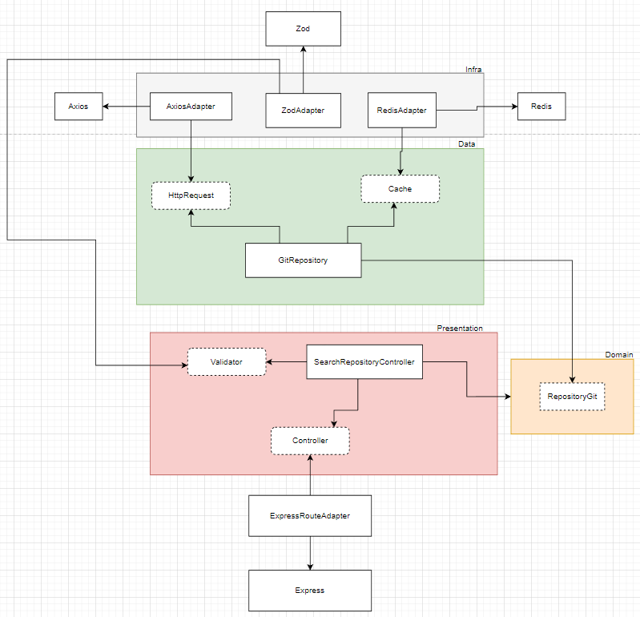
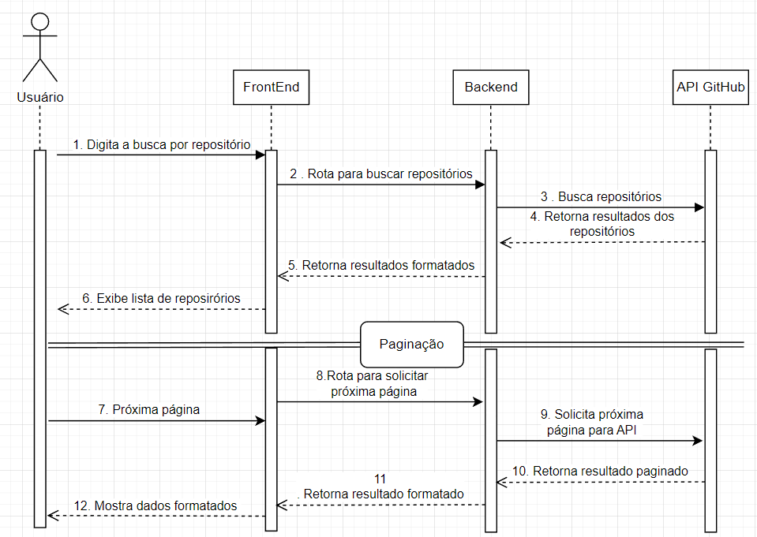
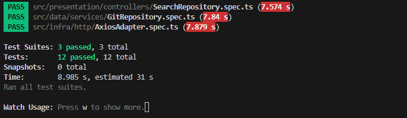

# API de Busca de Repositórios do GitHub

Esta API, escrita com `TypeScript`, `Node` e `Express`, que serve como um `proxy` otimizado para acessar a API do [GitHub](https://docs.github.com/pt/rest) e realizar as buscas por repositórios. A aplicação foi totalmente conainerizada com **Docker** a fim de garantir a fácil configuração e padronização do ambiente de desenvolvimento.

## ✨ Features

- **Arquitetura Limpa**: A aplicação foi dividida em camadas (Domain, Data, Presentation, Infra) para melhor organização e evitar o acoplamento entre as camadas e facilitar testes e uma alta coesão;
- **Cache com Redis**: Implementação de cache para evitar que o consumo de dados externos ocorra em excesso, além de otimizar o tempo de resposta para o usuário, impede a operação custosa que é acessar serviços externos, garantindo economia para a aplicação. Além de diminuir a latânecia das respostas da API externa;
- **Validação de Entrada**: Utilização para criar `Schemas` de validações robustas, garantindo assim que apenas os dados válidos e seguros sejam processados pela API;
- **Inversão de Dependência**: Faz com que as regras de negócios fiquem desacopladas dos detalhes de implementações, onde evita que nosso código fique acoplado com bibliotecas de terceiros, garantindo mais segurança e facilidade em trocas futuras a depender da regra de negócios;
- **Dokerização da API**: Permite que a API e seus serviços, `redis`, sejam iniciados apenas com um único comando;
- **Cobertura de testes**: Testes unitários para garantir que cada camada tenha confiabilidade e que assim facilita refatorações futuras.

## 🏛️ Arquitetura da Aplicação

A arquitetura da aplicação foi pensada seguindos os princípios da `Arquitetura Limpa`, separando as responsabilidades em suas devidas camadas:

1. **Domain**: Contém todas as entidades e regras de negócios, como `interfaces dos repositórios`;
2. **Data**: Responsável por orquestrar as fontes de dados, implementando as interfaces do domínio. A lógica da utilização do cache foi aplicada nessa camada;
3. **Presentation**: Responsável por receber as requisições `HTTP` e formatar as respostas. Contém os controllers, erros customizados e os helpers;
4. **Infra**: Contém os detalhes das implementações e a comunicação com ferramentas externas, como o cliente HTTP (`AxiosAdapter`), o cliente de cache (`RedisAdapter`) e o validador (`ZodValidatorAdapter`).

Veja o exemplo do esboço da arquitetura que foi utilizada no desenvolvimento backend.

|Arquitetura da aplicação|
|---|
||

## 📂 Estrutura de Pastas

A aplicação está organizada conforme a estrutura de pastas abaixo:

```
/
├── .dockerignore         # Ignora arquivos desnecessários no build do Docker
├── .env                  # Arquivo de variáveis de ambiente (local)
├── .env.example          # Exemplo de arquivo de ambiente
├── docker-compose.yml    # Orquestra os containers da API e do Redis
├── Dockerfile            # Define como construir a imagem Docker da API
├── package.json          # Dependências e scripts do projeto
├── tsconfig.json         # Configurações do compilador TypeScript
└── src/
    ├── data/             # Camada de Dados: implementa as regras de negócio
    │   ├── protocols/    # Contratos (interfaces) para a camada de dados
    │   └── services/     # Implementações (ex: GitRepository)
    │
    ├── domain/           # Camada de Domínio: o coração da aplicação
    │   └── interfaces/   # Entidades e regras de negócio puras
    │
    ├── infra/            # Camada de Infraestrutura: detalhes de implementação
    │   ├── cache/        # Adapters para o cache (RedisAdapter)
    │   ├── http/         # Adapters para clientes HTTP (AxiosAdapter)
    │   └── validators/   # Adapters para validação (ZodValidatorAdapter)
    │
    ├── main/             # Camada Principal: composição da aplicação
    │   ├── adapters/     # Adapters para o framework web (ExpressRouteAdapter)
    │   ├── factories/    # Fábricas para criar instâncias com injeção de dependência
    │   ├── routes/       # Definição das rotas da API
    │   └── schemas/      # Schemas de validação (Zod)
    │
    ├── presentation/     # Camada de Apresentação: lida com o mundo externo (HTTP)
    │   ├── controllers/  # Controladores que recebem as requisições
    │   ├── errors/       # Erros customizados da aplicação
    │   ├── helpers/      # Funções auxiliares para respostas HTTP
    │   └── protocols/    # Contratos (interfaces) para a camada de apresentação
    │
    └── Server.ts         # Ponto de entrada da aplicação (inicializa o Express)

```

- Tambeém foi elaborado o diagrama de seqêuencia para mostrar um esboço de como ocorre a sequência desde a solicitação do usuário no front até o acesso e retorno dos dados pelo nosso backend acessando a API externa do `GitHub`.


|Diagrama de sequência|
|---|
||

## 🛠️ Tecnologias Utilizadas
- **Backend**: [Node.js](https://nodejs.org/docs/latest/api/), [Express](https://expressjs.com/)
- **Linguagem**: [TypeScript](https://www.typescriptlang.org/docs/), 
- **Cache**: [Redis](https://redis.io/docs/latest/), [ioredis](https://www.npmjs.com/package/ioredis)
- **Validação**: [Zod](https://zod.dev/)
- **Testes**: [Jest](https://jestjs.io/docs/getting-started)
- **Contâiner**: [Docker](https://docs.docker.com/)

## 🚀 Como Rodar o Projeto

### Pré-requisitos
- [Node.js (v18 ou superior)](https://nodejs.org/docs/latest/api/)
- [Docker](https://docs.docker.com/)

### Setup
1. **Clone o repositório**
```bash
git clone [https://github.com/AdsonBruno/trabalhe-com-a-gente](https://github.com/AdsonBruno/trabalhe-com-a-gente)
cd api
```

2. **Crie o .env**
Na raíz do projeto, crie um arquivo chamado `.env` e copie o conteúdo do `.env.example`.

```bash
# .env
GITHUB_API_URL=https://api.github.com/search/repositories
PORT=3000
REDIS_HOST=redis-cache
REDIS_PORT=6379
```

<i>Nota: O `REDIS_HOST` deve ser `redis-cache`para que o container da API possa encontrar o container do Redis na rede interna do Docker.</i>

3. **Subindo os Containers**
Na raiz do projeto, execute o comando a seguir. Ele irá construi nossa imagem da API e permitirá a nossa comunicação entre o `front` e `back`.
```bash
docker-compose up --build
```

A `API` estará rodando no seguinte caminho `http://localhost:3000`

## ⚙️ Como Usar a API

### Endpoint de Busca

- **Métodos**: `GET`
- **URL**: `/api/search`

**Parâmetro (Query String)**:

| Parâmetro | Tipo | Obrigatório | Padrão | Descrição |
|:---:|:---:|:---:|:---:|:---:|
|`query`|`string`|Sim|-| Repositórios a serem buscados. |
|`page`|`number`|Não|1| Número da página de resultados. |
|`per_page`|`number`|Não|10| Número da itens por página (máximo: 100). |

### Exemplo de Requisição 
```bash
http://localhost:3000/api/search?query=go&per_page=3
```

### Exemplo de Resposta de Sucesso

```JSON
{
    "total_count": 3062473,
    "incomplete_results": false,
    "items": [
        {
            "id": 23096959,
            "node_id": "MDEwOlJlcG9zaXRvcnkyMzA5Njk1OQ==",
            "name": "go",
            "full_name": "golang/go",
            "private": false,
            "owner": {
                "login": "golang",
                "id": 4314092,
                "node_id": "MDEyOk9yZ2FuaXphdGlvbjQzMTQwOTI=",
                "avatar_url": "https://avatars.githubusercontent.com/u/4314092?v=4",
                "gravatar_id": "",
                "url": "https://api.github.com/users/golang",
                "html_url": "https://github.com/golang",
                "followers_url": "https://api.github.com/users/golang/followers",
                "following_url": "https://api.github.com/users/golang/following{/other_user}",
                "gists_url": "https://api.github.com/users/golang/gists{/gist_id}",
                "starred_url": "https://api.github.com/users/golang/starred{/owner}{/repo}",
                "subscriptions_url": "https://api.github.com/users/golang/subscriptions",
                "organizations_url": "https://api.github.com/users/golang/orgs",
                "repos_url": "https://api.github.com/users/golang/repos",
                "events_url": "https://api.github.com/users/golang/events{/privacy}",
                "received_events_url": "https://api.github.com/users/golang/received_events",
                "type": "Organization",
                "user_view_type": "public",
                "site_admin": false
            },
            "html_url": "https://github.com/golang/go",
            "description": "The Go programming language",
            "fork": false,
            "url": "https://api.github.com/repos/golang/go",
            "forks_url": "https://api.github.com/repos/golang/go/forks",
            "keys_url": "https://api.github.com/repos/golang/go/keys{/key_id}",
            "collaborators_url": "https://api.github.com/repos/golang/go/collaborators{/collaborator}",
            "teams_url": "https://api.github.com/repos/golang/go/teams",
            "hooks_url": "https://api.github.com/repos/golang/go/hooks",
            "issue_events_url": "https://api.github.com/repos/golang/go/issues/events{/number}",
            "events_url": "https://api.github.com/repos/golang/go/events",
            "assignees_url": "https://api.github.com/repos/golang/go/assignees{/user}",
            "branches_url": "https://api.github.com/repos/golang/go/branches{/branch}",
            "tags_url": "https://api.github.com/repos/golang/go/tags",
            "blobs_url": "https://api.github.com/repos/golang/go/git/blobs{/sha}",
            "git_tags_url": "https://api.github.com/repos/golang/go/git/tags{/sha}",
            "git_refs_url": "https://api.github.com/repos/golang/go/git/refs{/sha}",
            "trees_url": "https://api.github.com/repos/golang/go/git/trees{/sha}",
            "statuses_url": "https://api.github.com/repos/golang/go/statuses/{sha}",
            "languages_url": "https://api.github.com/repos/golang/go/languages",
            "stargazers_url": "https://api.github.com/repos/golang/go/stargazers",
            "contributors_url": "https://api.github.com/repos/golang/go/contributors",
            "subscribers_url": "https://api.github.com/repos/golang/go/subscribers",
            "subscription_url": "https://api.github.com/repos/golang/go/subscription",
            "commits_url": "https://api.github.com/repos/golang/go/commits{/sha}",
            "git_commits_url": "https://api.github.com/repos/golang/go/git/commits{/sha}",
            "comments_url": "https://api.github.com/repos/golang/go/comments{/number}",
            "issue_comment_url": "https://api.github.com/repos/golang/go/issues/comments{/number}",
            "contents_url": "https://api.github.com/repos/golang/go/contents/{+path}",
            "compare_url": "https://api.github.com/repos/golang/go/compare/{base}...{head}",
            "merges_url": "https://api.github.com/repos/golang/go/merges",
            "archive_url": "https://api.github.com/repos/golang/go/{archive_format}{/ref}",
            "downloads_url": "https://api.github.com/repos/golang/go/downloads",
            "issues_url": "https://api.github.com/repos/golang/go/issues{/number}",
            "pulls_url": "https://api.github.com/repos/golang/go/pulls{/number}",
            "milestones_url": "https://api.github.com/repos/golang/go/milestones{/number}",
            "notifications_url": "https://api.github.com/repos/golang/go/notifications{?since,all,participating}",
            "labels_url": "https://api.github.com/repos/golang/go/labels{/name}",
            "releases_url": "https://api.github.com/repos/golang/go/releases{/id}",
            "deployments_url": "https://api.github.com/repos/golang/go/deployments",
            "created_at": "2014-08-19T04:33:40Z",
            "updated_at": "2025-08-18T20:19:55Z",
            "pushed_at": "2025-08-18T20:12:55Z",
            "git_url": "git://github.com/golang/go.git",
            "ssh_url": "git@github.com:golang/go.git",
            "clone_url": "https://github.com/golang/go.git",
            "svn_url": "https://github.com/golang/go",
            "homepage": "https://go.dev",
            "size": 407016,
            "stargazers_count": 129461,
            "watchers_count": 129461,
            "language": "Go",
            "has_issues": true,
            "has_projects": true,
            "has_downloads": true,
            "has_wiki": true,
            "has_pages": false,
            "has_discussions": true,
            "forks_count": 18333,
            "mirror_url": null,
            "archived": false,
            "disabled": false,
            "open_issues_count": 9508,
            "license": {
                "key": "bsd-3-clause",
                "name": "BSD 3-Clause \"New\" or \"Revised\" License",
                "spdx_id": "BSD-3-Clause",
                "url": "https://api.github.com/licenses/bsd-3-clause",
                "node_id": "MDc6TGljZW5zZTU="
            },
            "allow_forking": true,
            "is_template": false,
            "web_commit_signoff_required": false,
            "topics": [
                "go",
                "golang",
                "language",
                "programming-language"
            ],
            "visibility": "public",
            "forks": 18333,
            "open_issues": 9508,
            "watchers": 129461,
            "default_branch": "master",
            "score": 1
        },
        {
            "id": 12104024,
            "node_id": "MDEwOlJlcG9zaXRvcnkxMjEwNDAyNA==",
            "name": "go",
            "full_name": "datasciencemasters/go",
            "private": false,
            "owner": {
                "login": "datasciencemasters",
                "id": 5228194,
                "node_id": "MDEyOk9yZ2FuaXphdGlvbjUyMjgxOTQ=",
                "avatar_url": "https://avatars.githubusercontent.com/u/5228194?v=4",
                "gravatar_id": "",
                "url": "https://api.github.com/users/datasciencemasters",
                "html_url": "https://github.com/datasciencemasters",
                "followers_url": "https://api.github.com/users/datasciencemasters/followers",
                "following_url": "https://api.github.com/users/datasciencemasters/following{/other_user}",
                "gists_url": "https://api.github.com/users/datasciencemasters/gists{/gist_id}",
                "starred_url": "https://api.github.com/users/datasciencemasters/starred{/owner}{/repo}",
                "subscriptions_url": "https://api.github.com/users/datasciencemasters/subscriptions",
                "organizations_url": "https://api.github.com/users/datasciencemasters/orgs",
                "repos_url": "https://api.github.com/users/datasciencemasters/repos",
                "events_url": "https://api.github.com/users/datasciencemasters/events{/privacy}",
                "received_events_url": "https://api.github.com/users/datasciencemasters/received_events",
                "type": "Organization",
                "user_view_type": "public",
                "site_admin": false
            },
            "html_url": "https://github.com/datasciencemasters/go",
            "description": "The Open Source Data Science Masters",
            "fork": false,
            "url": "https://api.github.com/repos/datasciencemasters/go",
            "forks_url": "https://api.github.com/repos/datasciencemasters/go/forks",
            "keys_url": "https://api.github.com/repos/datasciencemasters/go/keys{/key_id}",
            "collaborators_url": "https://api.github.com/repos/datasciencemasters/go/collaborators{/collaborator}",
            "teams_url": "https://api.github.com/repos/datasciencemasters/go/teams",
            "hooks_url": "https://api.github.com/repos/datasciencemasters/go/hooks",
            "issue_events_url": "https://api.github.com/repos/datasciencemasters/go/issues/events{/number}",
            "events_url": "https://api.github.com/repos/datasciencemasters/go/events",
            "assignees_url": "https://api.github.com/repos/datasciencemasters/go/assignees{/user}",
            "branches_url": "https://api.github.com/repos/datasciencemasters/go/branches{/branch}",
            "tags_url": "https://api.github.com/repos/datasciencemasters/go/tags",
            "blobs_url": "https://api.github.com/repos/datasciencemasters/go/git/blobs{/sha}",
            "git_tags_url": "https://api.github.com/repos/datasciencemasters/go/git/tags{/sha}",
            "git_refs_url": "https://api.github.com/repos/datasciencemasters/go/git/refs{/sha}",
            "trees_url": "https://api.github.com/repos/datasciencemasters/go/git/trees{/sha}",
            "statuses_url": "https://api.github.com/repos/datasciencemasters/go/statuses/{sha}",
            "languages_url": "https://api.github.com/repos/datasciencemasters/go/languages",
            "stargazers_url": "https://api.github.com/repos/datasciencemasters/go/stargazers",
            "contributors_url": "https://api.github.com/repos/datasciencemasters/go/contributors",
            "subscribers_url": "https://api.github.com/repos/datasciencemasters/go/subscribers",
            "subscription_url": "https://api.github.com/repos/datasciencemasters/go/subscription",
            "commits_url": "https://api.github.com/repos/datasciencemasters/go/commits{/sha}",
            "git_commits_url": "https://api.github.com/repos/datasciencemasters/go/git/commits{/sha}",
            "comments_url": "https://api.github.com/repos/datasciencemasters/go/comments{/number}",
            "issue_comment_url": "https://api.github.com/repos/datasciencemasters/go/issues/comments{/number}",
            "contents_url": "https://api.github.com/repos/datasciencemasters/go/contents/{+path}",
            "compare_url": "https://api.github.com/repos/datasciencemasters/go/compare/{base}...{head}",
            "merges_url": "https://api.github.com/repos/datasciencemasters/go/merges",
            "archive_url": "https://api.github.com/repos/datasciencemasters/go/{archive_format}{/ref}",
            "downloads_url": "https://api.github.com/repos/datasciencemasters/go/downloads",
            "issues_url": "https://api.github.com/repos/datasciencemasters/go/issues{/number}",
            "pulls_url": "https://api.github.com/repos/datasciencemasters/go/pulls{/number}",
            "milestones_url": "https://api.github.com/repos/datasciencemasters/go/milestones{/number}",
            "notifications_url": "https://api.github.com/repos/datasciencemasters/go/notifications{?since,all,participating}",
            "labels_url": "https://api.github.com/repos/datasciencemasters/go/labels{/name}",
            "releases_url": "https://api.github.com/repos/datasciencemasters/go/releases{/id}",
            "deployments_url": "https://api.github.com/repos/datasciencemasters/go/deployments",
            "created_at": "2013-08-14T08:33:55Z",
            "updated_at": "2025-08-18T18:49:40Z",
            "pushed_at": "2023-12-03T11:42:49Z",
            "git_url": "git://github.com/datasciencemasters/go.git",
            "ssh_url": "git@github.com:datasciencemasters/go.git",
            "clone_url": "https://github.com/datasciencemasters/go.git",
            "svn_url": "https://github.com/datasciencemasters/go",
            "homepage": "datasciencemasters.org",
            "size": 1378,
            "stargazers_count": 25612,
            "watchers_count": 25612,
            "language": null,
            "has_issues": true,
            "has_projects": true,
            "has_downloads": true,
            "has_wiki": true,
            "has_pages": true,
            "has_discussions": false,
            "forks_count": 6157,
            "mirror_url": null,
            "archived": false,
            "disabled": false,
            "open_issues_count": 39,
            "license": {
                "key": "unlicense",
                "name": "The Unlicense",
                "spdx_id": "Unlicense",
                "url": "https://api.github.com/licenses/unlicense",
                "node_id": "MDc6TGljZW5zZTE1"
            },
            "allow_forking": true,
            "is_template": false,
            "web_commit_signoff_required": false,
            "topics": [],
            "visibility": "public",
            "forks": 6157,
            "open_issues": 39,
            "watchers": 25612,
            "default_branch": "master",
            "score": 1
        },
        {
            "id": 66156850,
            "node_id": "MDEwOlJlcG9zaXRvcnk2NjE1Njg1MA==",
            "name": "Go",
            "full_name": "TheAlgorithms/Go",
            "private": false,
            "owner": {
                "login": "TheAlgorithms",
                "id": 20487725,
                "node_id": "MDEyOk9yZ2FuaXphdGlvbjIwNDg3NzI1",
                "avatar_url": "https://avatars.githubusercontent.com/u/20487725?v=4",
                "gravatar_id": "",
                "url": "https://api.github.com/users/TheAlgorithms",
                "html_url": "https://github.com/TheAlgorithms",
                "followers_url": "https://api.github.com/users/TheAlgorithms/followers",
                "following_url": "https://api.github.com/users/TheAlgorithms/following{/other_user}",
                "gists_url": "https://api.github.com/users/TheAlgorithms/gists{/gist_id}",
                "starred_url": "https://api.github.com/users/TheAlgorithms/starred{/owner}{/repo}",
                "subscriptions_url": "https://api.github.com/users/TheAlgorithms/subscriptions",
                "organizations_url": "https://api.github.com/users/TheAlgorithms/orgs",
                "repos_url": "https://api.github.com/users/TheAlgorithms/repos",
                "events_url": "https://api.github.com/users/TheAlgorithms/events{/privacy}",
                "received_events_url": "https://api.github.com/users/TheAlgorithms/received_events",
                "type": "Organization",
                "user_view_type": "public",
                "site_admin": false
            },
            "html_url": "https://github.com/TheAlgorithms/Go",
            "description": "Algorithms and Data Structures implemented in Go for beginners, following best practices.",
            "fork": false,
            "url": "https://api.github.com/repos/TheAlgorithms/Go",
            "forks_url": "https://api.github.com/repos/TheAlgorithms/Go/forks",
            "keys_url": "https://api.github.com/repos/TheAlgorithms/Go/keys{/key_id}",
            "collaborators_url": "https://api.github.com/repos/TheAlgorithms/Go/collaborators{/collaborator}",
            "teams_url": "https://api.github.com/repos/TheAlgorithms/Go/teams",
            "hooks_url": "https://api.github.com/repos/TheAlgorithms/Go/hooks",
            "issue_events_url": "https://api.github.com/repos/TheAlgorithms/Go/issues/events{/number}",
            "events_url": "https://api.github.com/repos/TheAlgorithms/Go/events",
            "assignees_url": "https://api.github.com/repos/TheAlgorithms/Go/assignees{/user}",
            "branches_url": "https://api.github.com/repos/TheAlgorithms/Go/branches{/branch}",
            "tags_url": "https://api.github.com/repos/TheAlgorithms/Go/tags",
            "blobs_url": "https://api.github.com/repos/TheAlgorithms/Go/git/blobs{/sha}",
            "git_tags_url": "https://api.github.com/repos/TheAlgorithms/Go/git/tags{/sha}",
            "git_refs_url": "https://api.github.com/repos/TheAlgorithms/Go/git/refs{/sha}",
            "trees_url": "https://api.github.com/repos/TheAlgorithms/Go/git/trees{/sha}",
            "statuses_url": "https://api.github.com/repos/TheAlgorithms/Go/statuses/{sha}",
            "languages_url": "https://api.github.com/repos/TheAlgorithms/Go/languages",
            "stargazers_url": "https://api.github.com/repos/TheAlgorithms/Go/stargazers",
            "contributors_url": "https://api.github.com/repos/TheAlgorithms/Go/contributors",
            "subscribers_url": "https://api.github.com/repos/TheAlgorithms/Go/subscribers",
            "subscription_url": "https://api.github.com/repos/TheAlgorithms/Go/subscription",
            "commits_url": "https://api.github.com/repos/TheAlgorithms/Go/commits{/sha}",
            "git_commits_url": "https://api.github.com/repos/TheAlgorithms/Go/git/commits{/sha}",
            "comments_url": "https://api.github.com/repos/TheAlgorithms/Go/comments{/number}",
            "issue_comment_url": "https://api.github.com/repos/TheAlgorithms/Go/issues/comments{/number}",
            "contents_url": "https://api.github.com/repos/TheAlgorithms/Go/contents/{+path}",
            "compare_url": "https://api.github.com/repos/TheAlgorithms/Go/compare/{base}...{head}",
            "merges_url": "https://api.github.com/repos/TheAlgorithms/Go/merges",
            "archive_url": "https://api.github.com/repos/TheAlgorithms/Go/{archive_format}{/ref}",
            "downloads_url": "https://api.github.com/repos/TheAlgorithms/Go/downloads",
            "issues_url": "https://api.github.com/repos/TheAlgorithms/Go/issues{/number}",
            "pulls_url": "https://api.github.com/repos/TheAlgorithms/Go/pulls{/number}",
            "milestones_url": "https://api.github.com/repos/TheAlgorithms/Go/milestones{/number}",
            "notifications_url": "https://api.github.com/repos/TheAlgorithms/Go/notifications{?since,all,participating}",
            "labels_url": "https://api.github.com/repos/TheAlgorithms/Go/labels{/name}",
            "releases_url": "https://api.github.com/repos/TheAlgorithms/Go/releases{/id}",
            "deployments_url": "https://api.github.com/repos/TheAlgorithms/Go/deployments",
            "created_at": "2016-08-20T16:32:12Z",
            "updated_at": "2025-08-18T21:50:10Z",
            "pushed_at": "2025-08-18T21:53:04Z",
            "git_url": "git://github.com/TheAlgorithms/Go.git",
            "ssh_url": "git@github.com:TheAlgorithms/Go.git",
            "clone_url": "https://github.com/TheAlgorithms/Go.git",
            "svn_url": "https://github.com/TheAlgorithms/Go",
            "homepage": "https://the-algorithms.com/language/go",
            "size": 2615,
            "stargazers_count": 17228,
            "watchers_count": 17228,
            "language": "Go",
            "has_issues": true,
            "has_projects": false,
            "has_downloads": true,
            "has_wiki": false,
            "has_pages": false,
            "has_discussions": true,
            "forks_count": 2733,
            "mirror_url": null,
            "archived": false,
            "disabled": false,
            "open_issues_count": 9,
            "license": {
                "key": "mit",
                "name": "MIT License",
                "spdx_id": "MIT",
                "url": "https://api.github.com/licenses/mit",
                "node_id": "MDc6TGljZW5zZTEz"
            },
            "allow_forking": true,
            "is_template": false,
            "web_commit_signoff_required": false,
            "topics": [
                "algorithms",
                "algorithms-implemented",
                "community-driven",
                "data-structures",
                "datastructures",
                "hacktoberfest",
                "interview",
                "interview-preparation",
                "preparation",
                "search",
                "sorting"
            ],
            "visibility": "public",
            "forks": 2733,
            "open_issues": 9,
            "watchers": 17228,
            "default_branch": "master",
            "score": 1
        }
    ]
}
```

### Rodando os Testes

```bash
npm run test:only
```

|Testes|
|---|
||