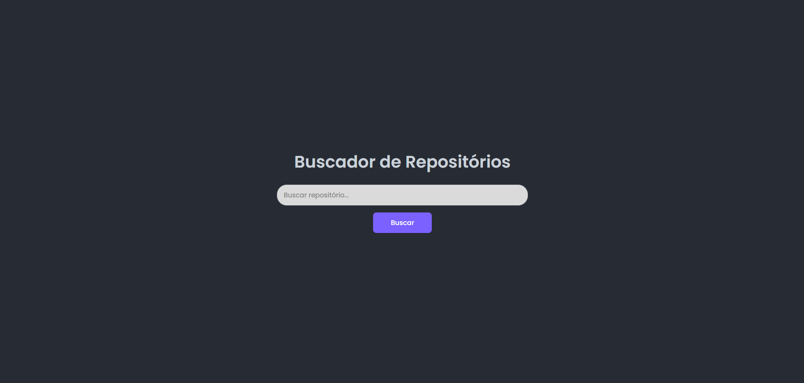
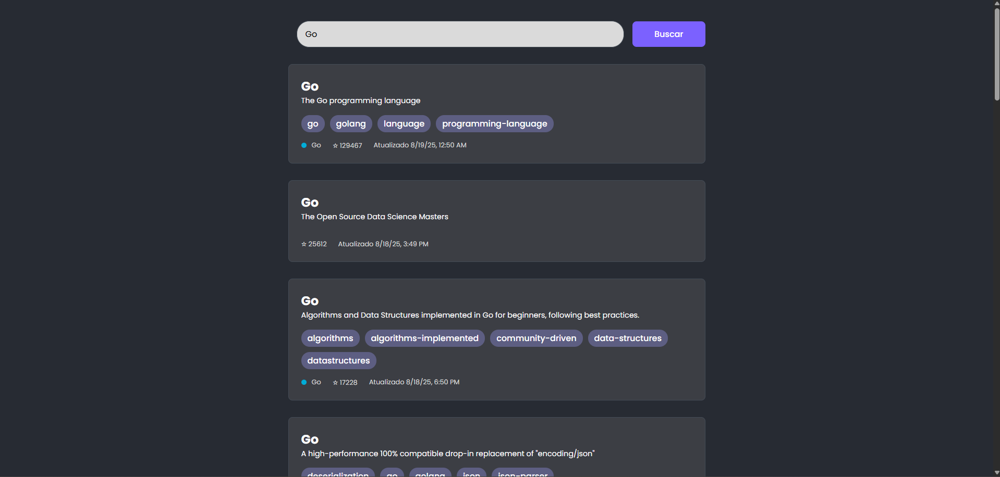
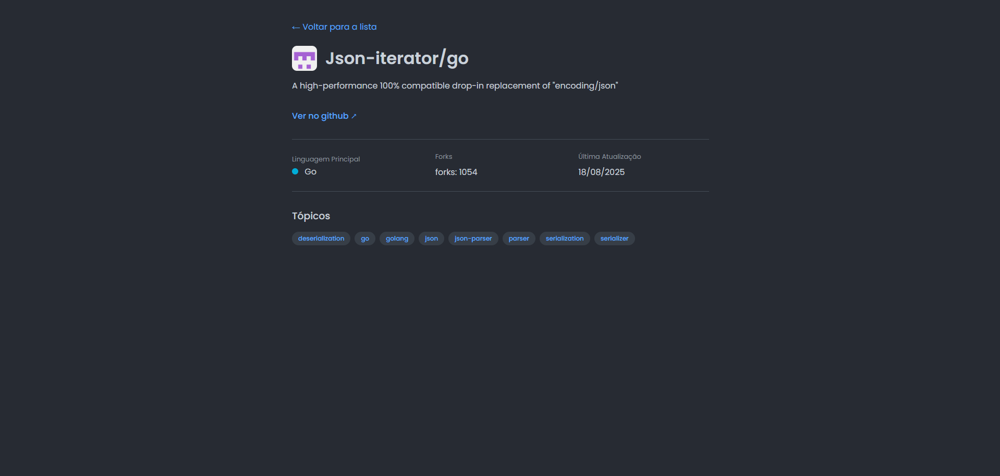

# Buscador de Repositórios - Frontend (Angular)

Este é o `frontend` escrito em `Angular 20` que consome a API backend para fornecer uma experiência fluída e moderna para o usuário. A página reage ao estado da busca, onde inicia com uma página com uma barra para pesquisar e depois ocorre a transição para a lista de repositórios encontrados.

## ✨ Features

- **Arquitetura Limpa e Desacoplada**: A aplicação é organizada por funcionalidades, com uma clara separação de responsabilidades entre componentes (`UI`), serviços (`lógica de dados`), adaptadores (`transformação de dados`) e um serviço de estado para comunicação entre rotas;
- **Reatividade Moderna com Signals**: O estado dos componentes é gerido de forma eficiente com [Signals](https://angular.dev/guide/signals) e `Computed Signals`, garantindo um código mais performático e um código mais limpo e previsível;
- **UI Polida e Animada**: A interface da aplicação utiliza transições `scss` e animações em cascata para carregar os resultados, proporcionando uma experiência agradável para o usuário;
- **Desacomplamento de Dados com o Padrão Adapter**: Implementação do padrão de projeto `Adapter` para transformar a respostra da API no modelo de domínio próprio do frontend, exibindo apenas os dados mais importantes. Isto garante **resiliência** na UI e garantindo mais segurança em mudanças futuras na API, tornado sua manutenção bem mais fácil;
- **Boas Práticas Angular**: Utiliza `Standalone Components` para uma arquitetura mais simples e modular, `Lazy Loading` para as rotas para deixar o carregamento inicial mais otimizado e `Pipes`customizados para formatação de dados no template.

## 🏛️ Arquitetura

O projeto foi estruturado para garanti a separação de interesses e a escalabilidade:

**A estrutura de pastas principal dentro de `src/app/` é a seguinte:**

```
src/
└── app/
    ├── core/                  # Serviços "singleton" e lógica central da aplicação.
    │   └── state.service.ts
    ├── features/              # Contém as funcionalidades principais da aplicação.
    │   ├── repositories/      # Feature de busca e listagem.
    │   │   ├── adapters/
    │   │   │   └── repository.adapter.ts
    │   │   ├── components/
    │   │   │   └── repository-card/
    │   │   ├── models/
    │   │   ├── pipes/
    │   │   ├── services/
    │   │   ├── repositories.component.html
    │   │   ├── repositories.component.scss
    │   │   └── repositories.component.ts
    │   └── repository-detail/ # Feature da página de detalhes.
    │       ├── repository-detail.component.html
    │       ├── repository-detail.component.scss
    │       └── repository-detail.component.ts
    ├── app.component.ts       # Componente raiz (casca da aplicação).
    ├── app.config.ts          # Configuração principal da aplicação.
    └── app.routes.ts          # Definição das rotas.
```

1. **Core**: Contém toda a lógica de `Singleton` e serviços partilhados por toda a aplicação, como o `StateService`;
2. **Features**: Cada funcionalidade principal da aplicação vive no seu próprio `módulo`;
   - **Repositories**: Contém a lógica e a `UI` para a busca e listagem de repositórios;
   - **Repository-Detail**: Contém a lófica e a `UI` para a página de detalhes.
3. **Estrutura de uma Feature**:
   - **Components**: Componentes reutilizáveis de `UI` (`RepositoryCard`).
   - **Services**: Responsáveis pela comunicação com o backend (`GithubService`).
   - **Adapters**: Responsáveis por transformar os dados da API (`RepositoryAdapter`).
   - **Pipes**: Classes de transformação de dados para o template (`CapitalizePipe`, `LanguageColorPipe`).
   - **Models**: Contratos de tipo (`interfaces`) para os dados da API e do domínio da aplicação.

## 🛠️ Tecnologias Utilizada

- **Linguagem**: [TypeScript](https://www.typescriptlang.org/docs/)
- **Framework**: [Angular (v20)](https://angular.dev/)
- **Estilização**: [SCSS](https://sass-lang.com/)
- **Reatividade**: [RxJS](https://rxjs.dev/) (para chamadas `HTTP`), [Angular Signals](https://angular.dev/guide/signals)
- **Testes**: [Karma](https://karma-runner.github.io/latest/index.html), [Jasmine](https://jasmine.github.io/)

## 🚀 Como Rodar o Projeto

### Pré-requisitos

- [Node.js (v18 ou superio)](https://nodejs.org/en/)
- [Angular CLI (v20 ou superior)](https://angular.dev/)
- **OBS.: A API BACKEND DEVE ESTAR RODANDO EM `http://localhost:3000`** para que a aplicação possa realizar a consulta

### Setup

1. **Clone o repositório** e navegue para a pasta do frontend:

```bash
  git clone https://github.com/AdsonBruno/trabalhe-com-a-gente
  git clone https://github.com/AdsonBruno/trabalhe-com-a-gente
```

2. **Instale as dependências**:

```bash
  npm install
```

3. **Execute a aplicação**:

```bash
  npm start
```

A aplicação estará disponível em `http://localhost:4200`.

## ✅ Rodando os Testes

Para executar os testes de unidade, use o comando:

```bash
  ng test
```
## Imagens da Aplicação rodando

|Tela de Busca|
|---|
||

|Lista de Repositórios Encontrados|
|---|
||

|Detalhes do Repositório|
|---|
||